# AI Image Generator

This is a web application that generates original, realistic images and art from a short text description and allows users to download, share, or save them in their collections. It uses OpenAI APIs to generate the images and various technologies such as **_React, Redux, Formik, Yup, MUI, Node.js, Express.js, MongoDB, mongoose, Joi, Google Oauth, Facebook Oauth, Nodemailer, JWT, Redis, multer, Cloudinary,_** _and_ **_Bcrypt_** for implementation.

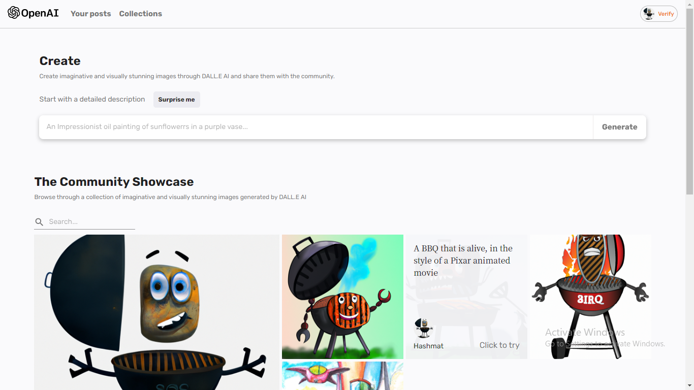
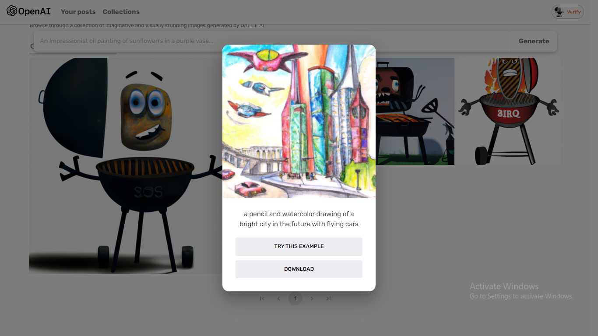

## Features

The project comes with the following features:

### **1. Generating Images with OpenAI APIs and Sharing Options**

user can create images from textual prompts, then choose to share it publicly or download/save it in their private collections.

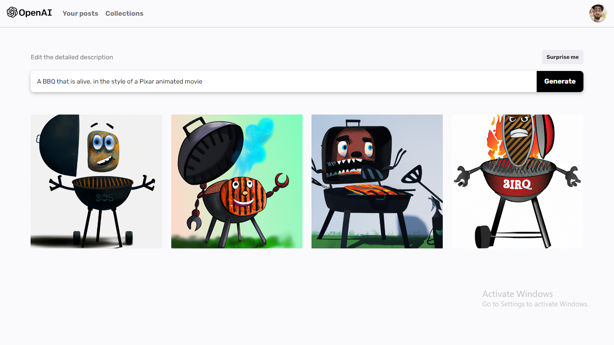
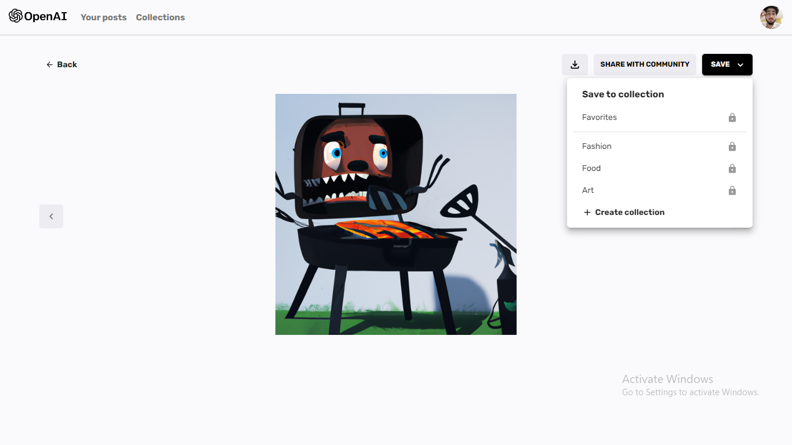

### **2. Storing Images with Cloudinary**

This project allows users to share images with community. To store these images, we use Cloudinary, a cloud-based image and video management platform that provides APIs for uploading, manipulating, and delivering images and videos.

<ins>How it works</ins>

When a user shares an image, it is sent to the server using a multipart/form-data form. The server then uses the multer middleware to handle the file upload and store the image temporarily on the server's disk.

Once the image is uploaded, the server uses the Cloudinary API to upload the image to the Cloudinary platform. The Cloudinary API returns a URL for the image, which is stored in the database along with the user's ID and other metadata.

To display the image, the client-side application fetches the image URL from the database and uses it to display the image in the user interface.

### **3. Creating and Editing Collections**

Users can create collections to organize their posts and images. Each collection has a name, and can contain any number of posts and images. Users can edit the name of their collections at any time.

<ins>How it works</ins>

To create a new collection, the client-side application sends a request to the server with the name of the collection. The server creates a new collection in the database and returns the new collection to the client.

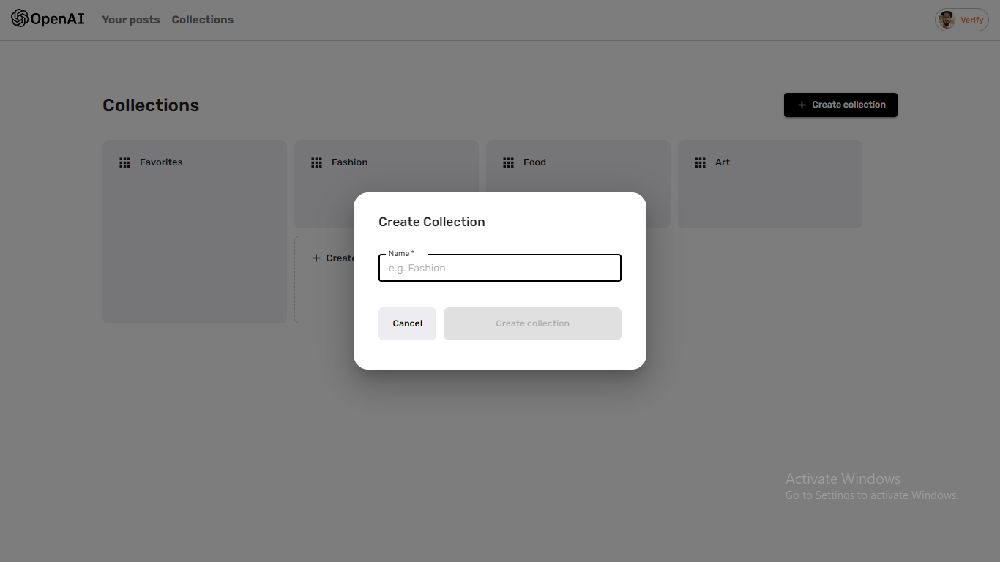

To edit an existing collection, the client-side application sends a request to the server with the ID of the collection and the new name description. The server updates the collection in the database and returns the updated collection to the client.

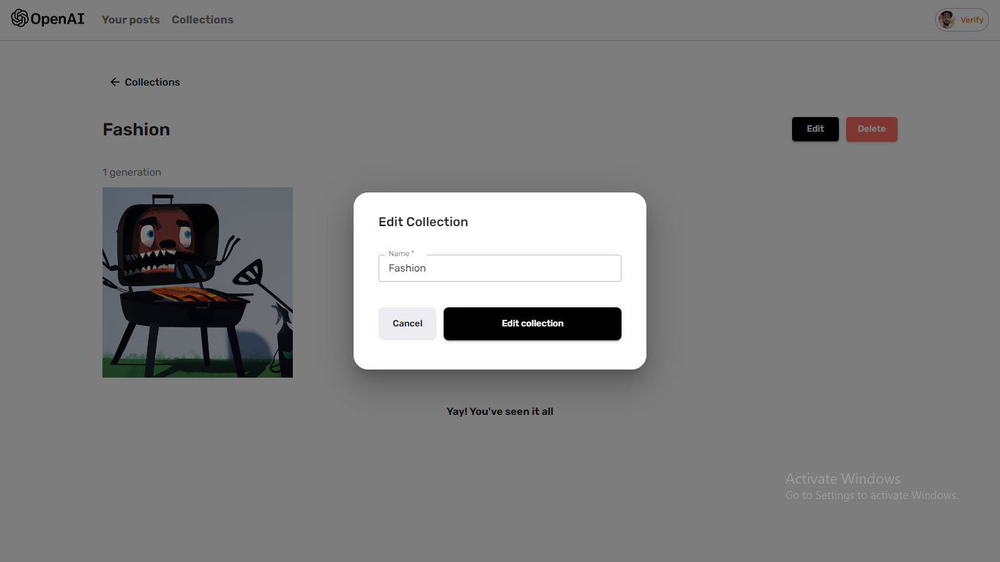


### **4. Infinite Scrolling for User Posts**

This project includes a feature that allows users to scroll through their posts using infinite scrolling. Infinite scrolling allows the user to load new posts automatically as they reach the end of the current page of posts. This improves the user experience by eliminating the need to click on a "Load More" button to view additional posts.

<ins>Infinite Scrolling Workflow</ins>

- The user scrolls through their posts.
- When the user reaches the end of the current page of posts, the platform automatically loads the next page of posts.
- The new posts are added to the existing list of posts.
- The user continues scrolling through the posts


### **5. User Registration and Login**

This project provides a user registration and login feature, which allows users to create an account, log in, and access their account information.

<ins>User Registration</ins>

To register as a new user, the user must provide their name, email, and password. The email address is used to verify the user's identity and prevent spam or fraudulent registrations. The password is encrypted using bcrypt to ensure that it is stored securely.

Once the user has registered, they will receive a verification email with a link to verify their email address. This step ensures that the user has access to the email address they provided and helps to prevent fake or spam accounts.


<ins>User Login</ins>

To log in, the user must enter their email address and password. The email address is used to identify the user, and the password is verified using bcrypt to ensure that it matches the password stored in the database.

If the user enters the correct email address and password, they will be authenticated and granted access to their account. A JWT (JSON Web Token) is generated and stored in a cookie, which is used to authenticate subsequent requests.


### **6. Facebook and Google Authentication**

This project allows users to authenticate themselves with Facebook or Google authentication. This feature is implemented using OAuth, which is a standard protocol for authentication and authorization.

<ins>How Facebook and Google Authentication Work<ins>

OAuth is an open standard for authorization that allows third-party applications to access user data without requiring the user to disclose their login credentials. This allows users to log in to applications using their Facebook or Google accounts.

When a user logs in with Facebook or Google, the application sends a request to the Facebook or Google OAuth server, which prompts the user to log in and authorize the application. Once the user has logged in and authorized the application, the OAuth server sends an access token to the application, which can then use the token to access the user's data.

### **7. OTP Verification for Email Verification**

When a user registers on the platform(without Google and Facebook OAuth), they are required to verify their email address. The verification process involves sending an OTP (One-Time Password) to the user's email address. The user then enters the OTP on the platform to verify their email address.

<ins>The OTP verification process is implemented using the following technologies:</ins>

- Nodemailer for sending emails
- Joi for validating user input
- Bcrypt for hashing OTPs before storing them in db.

<ins>OTP Verification Workflow</ins>

- When a user registers on the platform, they are required to provide their email address.
- The platform generates a random OTP and sends it to the user's email address using Nodemailer.
- The user enters the OTP on the platform and submits it for verification.
- The platform validates the user input using Joi to ensure that the OTP is in the correct format.
- The platform retrieves the OTP from db using the email address as the key.
- The platform compares the OTP entered by the user with the one retrieved from db.
- If the OTPs match, the platform marks the email address as verified in the database and deletes the OTP from db.
- If the OTPs do not match, the platform returns an error message to the user.


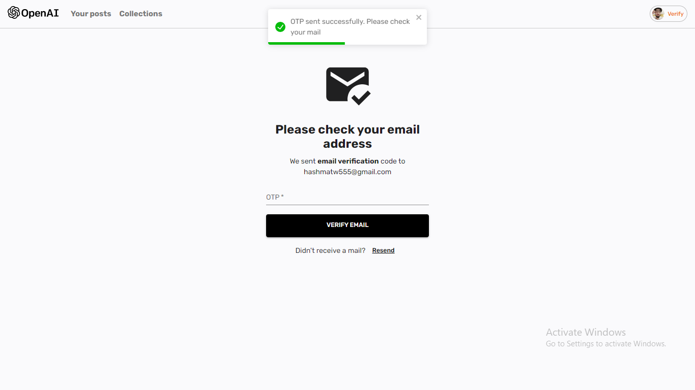

### **8. Changing User Profile Picture with Cloudinary**

This project includes a feature that allows users to change their profile picture. The new picture is uploaded to Cloudinary, a cloud-based image and video management service. Cloudinary stores the new image and provides a URL that can be used to display the image on the platform.

<ins>Changing Profile Picture Workflow</ins>

- The user clicks on the "Edit Profile" button on their profile page.
- The user selects a new profile picture from their device.
- The platform uploads the picture to Cloudinary.
- Cloudinary provides a URL for the new image.
- The platform saves the new URL to the user's account in the database.
- The new profile picture is displayed on the user's profile page.

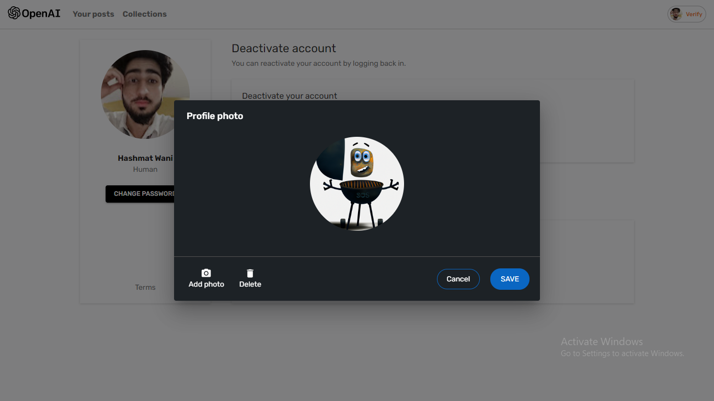

### **9. Refresh Tokens with Axios Interceptors and Cookies**

This project uses Axios interceptors and cookies to implement refresh tokens for improved security of user authentication.

<ins>How Refresh Tokens Work</ins>

When a user logs in or authenticates, the server generates an access token and a refresh token. The access token is a short-lived token that is used to authenticate the user for a limited period of time. The refresh token is a longer-lived token that is used to obtain a new access token when the original access token expires.

When the user's access token expires, the client sends a request to the server to obtain a new access token with the help of axios interceptor. The server verifies the user's refresh token and generates a new access token, which is then sent back to the client. This process is transparent to the user and does not require the user to re-authenticate.

### **10. Logout Feature with Redis**

This project provides a logout feature that allows users to log out of their account and invalidate their JWT. To implement this feature, we use Redis to store a list of blacklisted JWTs that have been invalidated.

<ins>How it works</ins>

When a user logs in, a JWT is generated and stored in a cookie. The JWT contains a payload with the user's ID and name, which is used to authenticate the user for subsequent requests.

When the user logs out, their JWT is added to a Redis set called blacklist, which contains all the JWTs that have been invalidated. This set is checked on every subsequent request to ensure that the user's JWT has not been blacklisted.

If the JWT is found in the blacklist set, the user will be redirected to the login page and prompted to log in again. This ensures that even if someone gains access to the user's JWT, they will not be able to use it to access the user's account.

### **11. Reset Password Feature**

This project also includes a reset password feature. When a user forgets their password, they can request a password reset by providing their email address. An email is then sent to the user's email address containing a link to reset their password. The link contains a unique ticket that is valid for a limited time. The user clicks on the link to reset their password.

<ins>The reset password process is implemented using the following technologies:</ins>

- Nodemailer for sending emails
- Joi for validating user input
- db for storing tokens temporarily
- Bcrypt for hashing passwords

<ins>Reset Password Workflow</ins>

- When a user clicks on the "Forgot Password" link, they are required to provide their email address.
- The platform generates a random password reset ticket and sends it to the user's email address using Nodemailer.
- The user clicks on the password reset link in the email.
- The platform validates the password reset ticket included in the link using Joi to ensure that it is in the correct format.
- The platform retrieves the password reset ticket from db using the email address as the key.
- The platform compares the password reset ticket included in the link with the one retrieved from db.
- If the tickets match, the user is allowed to reset their password.
- If the tickets do not match, the platform returns an error message to the user.
- The user enters their new password and submits it for verification.
- The platform hashes the new password using Bcrypt and updates the user's password in the database.


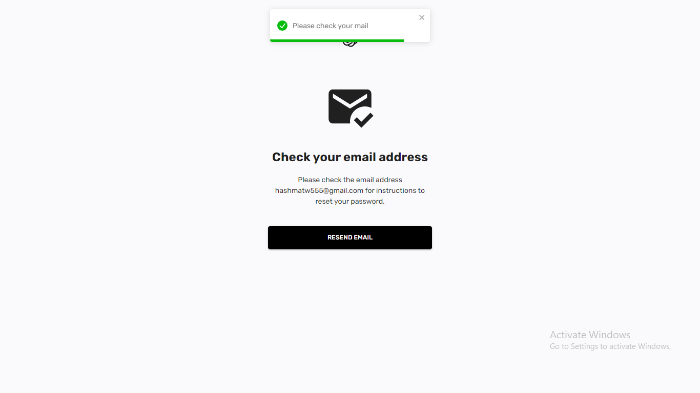
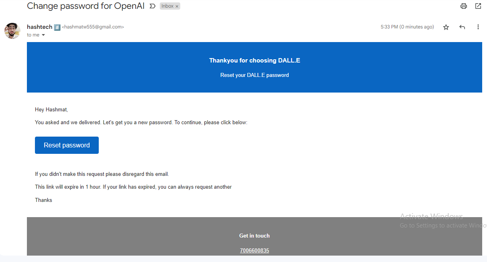
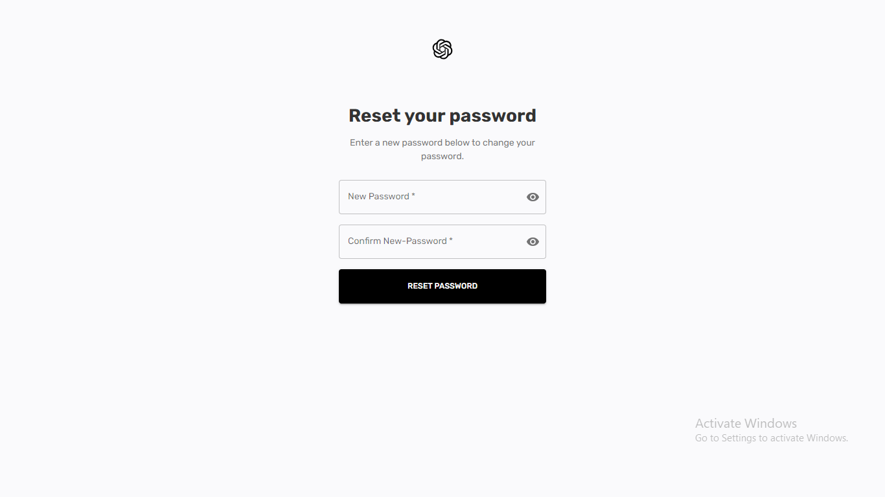


### **12. Deactivating User Accounts**

This project allows users to deactivate their accounts. When a user deactivates their account, all their posts are hidden from others, and they can no longer access the application. However, their data is not deleted from the database, so they can log in again later if they choose to reactivate their account.

<ins>How it works<ins>

To deactivate a user's account, the client-side application sends a request to the server to change the isActive field of the user in the database to false. When this field is set to false, the user is no longer able to access the application, and their posts are hidden from other users.

When the user wants to reactivate their account, they can log in again using their email and password, and the server sets the isActive field back to true. This allows the user to access the application and see their posts again.

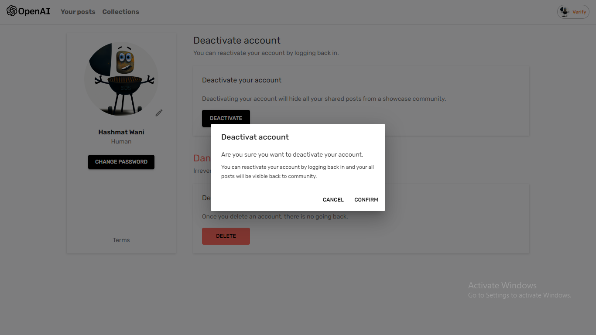

### **13. Deleting User Accounts**

In addition to deactivating their accounts, users can also delete their accounts entirely. When a user deletes their account, all their posts, collections, and profile picture are deleted from the database and from the cloudinary storage. The user will no longer be able to access the application, and their data will be permanently removed.

<ins>How it works</ins>

To delete a user's account, the client-side application sends a request to the server to delete the user's data from the database and from the cloudinary storage. When this process is complete, the user will no longer be able to access the application.

Before deleting the user's data, the server checks if the user is authenticated and if they have permission to delete their account. If the user is not authenticated or does not have permission to delete their account, the server returns an error response.

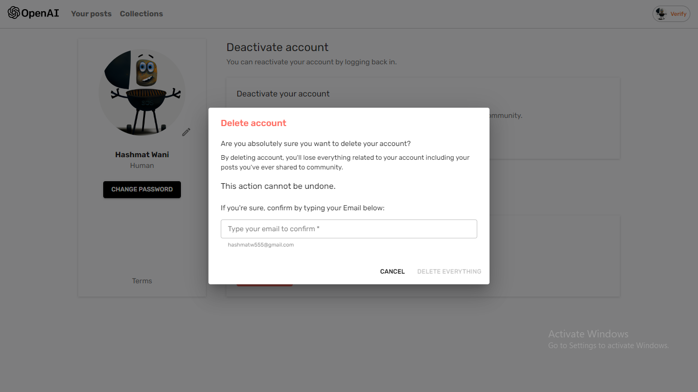

## Installation and Setup

To get started with the project, you will need to have the following installed on your local machine:

- Node.js
- npm or yarn package manager
- MongoDB

After installing the required software, follow the steps below to set up and run the project:

Installation
Clone this repository to your local machine by running the below command:

```
git clone https://github.com/hashmat-noorani/AI-Image-Generator-DALL.E.git
```

Install the dependencies by running the command:

```
npm install.
```

Create a .env file in the root directory and add the required environment variables. Refer to the .env.example file for the list of variables required.

Start the application by running the command:

```
npm start.
```

The application will be running on http://localhost:3000/.
Run the following command to start the development server:

```
npm run dev
```

## Contributing

Contributions to the project are welcome. To contribute, follow the steps below:

- Fork the repository and clone it to your local machine.
- Create a new branch for your contribution.
- Make your changes and ensure that the project still works as expected.
- Commit your changes and push them to your fork.
- Create a pull request to the original repository and describe your changes in detail.
- Wait for your pull request to be reviewed and merged.
